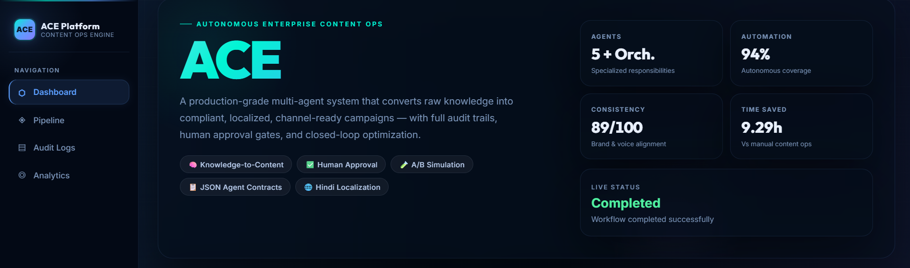
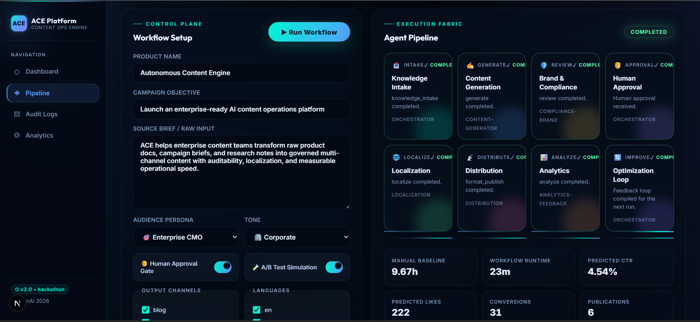
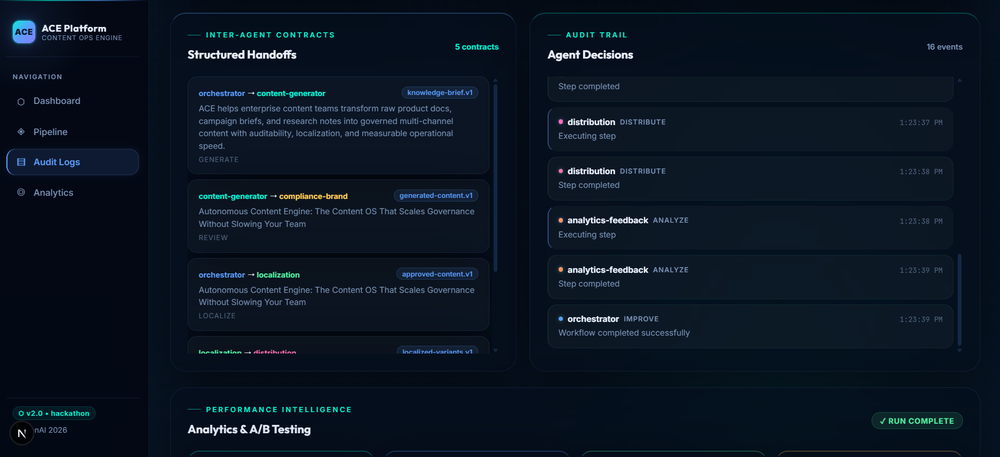
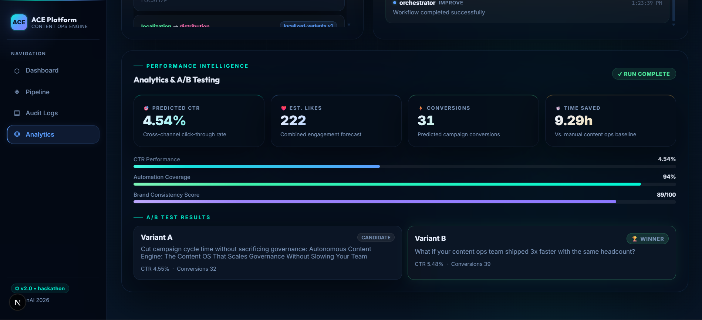

# Autonomous Content Engine (ACE)

Autonomous Content Engine (ACE) is a multi-agent content operations platform built for the ET AI Hackathon 2026. It turns raw briefs or uploaded PDF knowledge sources into compliant, localized, channel-ready marketing content with audit trails, approval checkpoints, simulated publishing, and performance insights.

## What It Does

- Converts raw text briefs or PDF documents into structured knowledge briefs
- Orchestrates a multi-agent workflow for generation, review, localization, distribution, and analytics
- Supports human approval gates before publication
- Produces channel-ready content for blog, LinkedIn, and Twitter/X
- Generates English and Hindi output variants
- Shows audit logs, handoff contracts, KPI cards, and A/B testing insights in a polished dashboard

## Workflow

1. Knowledge intake normalizes the source input
2. Content generation creates campaign-ready copy
3. Compliance and brand review refines the draft
4. Human approval pauses the flow when enabled
5. Localization adapts content for English and Hindi
6. Distribution formats output for selected channels
7. Analytics estimates CTR, likes, conversions, and time saved
8. Improvement planning recommends the next optimization loop

## Tech Stack

- Next.js 15
- React 19
- TypeScript
- `pdf-parse`

## Project Structure

```text
app/                  Next.js App Router pages and API routes
lib/ace/              Multi-agent workflow logic, types, utilities, and store
assets/screenshots/   README screenshots
```

## Getting Started

```bash
npm install
npm run dev
```

Open `http://localhost:3000` in your browser.

## Build

```bash
npm run build
```

## Screenshots

<table>
  <tr>
    <td></td>
    <td></td>
  </tr>
  <tr>
    <td></td>
    <td></td>
  </tr>
</table>

## Highlights

- Multi-agent orchestration with structured handoff contracts
- Real-time workflow progress and audit visibility
- PDF extraction pipeline for knowledge-to-content generation
- Approval-aware publishing flow
- Simulated analytics and A/B testing for iterative improvement

## License

This project was prepared for ET GEN AI Hackathon, Phase 2: Build Sprint - Prototype Submission.
